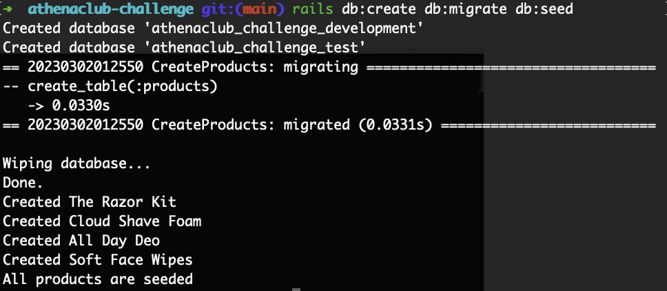

# Athena Club - Technical Challenge

## Description

[Demo](targetURL)

Recreated the carousel(slider) product that can be found on [https://www.athenaclub.com/](https://www.athenaclub.com/) using Ruby on Rails full-stack framework.

## Technologies

* @Hotwired/Stimulus 3.2.1
* Bootstrap 5.2.3
* PostgreSQL 14.5
* Rails 7.0.4
* Ruby 3.1.2
* Stimulus-use 0.52 for responsiveness for the slider
* tiny-slider 2.9.4

## Installation

### Setup Environment
<details>
<summary>First, you'll need to setup your Ruby on Rails environment. If your environment is already setup, please proceed to the following step. </summary>

<br>

<details>
<summary>MAC OS</summary>
<br>

#### rbenv

Installing rbenv with [Homebrew](https://brew.sh/)

```
brew install rbenv
```

#### ruby

Now, install the latest ruby version and set it as the default version.

Run this command, it will take a while (5-10 minutes)
```
rbenv install 3.1.2
```
Once the ruby installation is done, run this command to tell the system to use the 3.1.2 version by default.
```
rbenv global 3.1.2
```
Reset your terminal and check your Ruby version:
```
ruby -v
```

#### Installing rails gem

In your terminal, run
```
gem install rails
```

#### Installing PostgreSQL

Run the following commands:

```
brew install postgresql
```
```
brew services start postgresql
```

Once you've done that, let's check that it worked:
```
psql -d postgres
```

You should you see a new prompt like this one 👇
```
psql (14.4)
Type "help" for help.

postgres=#
```

</details>

<details>
<summary>Windows</summary>
<br>

#### rbenv
Let's install [```rbenv```](https://github.com/rbenv/rbenv), a version manager tool for ```ruby``` programming language.

In your terminal, run

```
sudo apt install -y build-essential tklib zlib1g-dev libssl-dev libffi-dev libxml2 libxml2-dev libxslt1-dev libreadline-dev
```

```
git clone https://github.com/rbenv/rbenv.git ~/.rbenv'
```

```
git clone https://github.com/rbenv/ruby-build.git ~/.rbenv/plugins/ruby-build
```

Restart your shell so that these changes take effect.

#### ruby

Now, install the latest ruby version and set it as the default version.

Run this command, it will take a while (5-10 minutes)
```
rbenv install 3.1.2
```
Once the ruby installation is done, run this command to tell the system to use the 3.1.2 version by default.
```
rbenv global 3.1.2
```
Reset your terminal and check your Ruby version:
```
ruby -v
```

#### Installing rails gem

In your terminal, run
```
gem install rails
```

#### Installing PostgreSQL

In your terminal, run

```
sudo apt install -y postgresql postgresql-contrib libpq-dev build-essential
```

```
sudo /etc/init.d/postgresql start
```
```
sudo -u postgres psql --command "CREATE ROLE \"`whoami`\" LOGIN createdb superuser;"
```
You can configure PostgreSQL to autostart, so you don't have to execute sudo /etc/init.d/postgresql start each time you open a new terminal:
```
sudo echo "`whoami` ALL=NOPASSWD:/etc/init.d/postgresql start" | sudo tee /etc/sudoers.d/postgresql
```
```
sudo chmod 440 /etc/sudoers.d/postgresql
```
```
echo "sudo /etc/init.d/postgresql start" >> ~/.zshrc
```

</details>
</details>

### Clone repository & getting started

In your terminal, run the following command to clone the GitHub repository:

```
git clone git@github.com:wendy-ph/athenaclub-challenge.git
```

Navigate into the folder on your local machine that has the cloned repository
```
cd athenaclub-challenge
```
Run the following commands to install the app's dependencies and create the database:
```
bundle install
yarn install
rails db:create db:migrate db:seed
```
After running the last command line, you should see the following in your terminal:



You are now ready to explore the app!
To view it locally, run ```rails s``` in your terminal and open your web browser to http://localhost:3000/.
Alternatively, you can view it live [here].

## Getting around the app

### Backend

The ```products.json``` file is stored in ```athenaclub-challenge/db```. The products were added to the database via ```db/seeds.rb```.

To access the ```products``` from the front-end, I created an instance variable ```@products``` in ```app/controllers/products_controller.rb```

### Frontend

#### HTML

The HTML markup for the carousel can be found in ```app/views/products/index.html.erb```

#### Javascript

* The Javascript code to initialize ```tiny-slider``` for the carousel can be found in ```app/javascript/controllers/slider_controller.rb```.
* You will also find the function ```star()``` to convert ```product.rating``` into star ratings.
* ```hideBtn()``` is used to hide the slider navigation btn at start and end of slider when not in mobile view.
* ```useMatchMedia()```, ```smallChanged()```, ```isSmall()``` and ```notSmall()``` are functions from ```stimulus-use``` package that are used to call ```tiny-slider```

#### Stylesheet

Styling for bubble element can be found in ```app/assets/stylesheets/components/_bubble.scss```

Styling for the carousel(slider) can be found in ```app/assets/stylesheets/components/_slider.scss```

Custom font can be found in ```app/assets/stylesheets/config/_fonts.scss```
